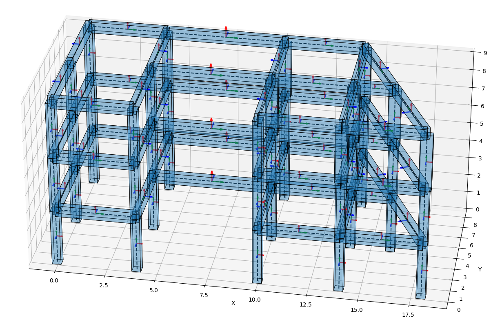

# Mis Proyectos :sparkles:

## 1. Automatización de Análisis Lineal Tiempo Historia con OpenSeesPy

**Descripción:**  
Este proyecto utiliza OpenSeesPy para automatizar un análisis lineal tiempo historia en una estructura irregular. El código incluye:  
- Modelamiento estructural a partir de datos ingresados por el usuario en un archivo Excel para nodos y elementos.  
- Análisis tiempo historia usando un registro sísmico obtenido de la web del CISMID REDACIS.  

**Características principales:**  
- Modelamiento eficiente de estructuras complejas.  
- Uso directo de datos en formato Excel.  
- Resultados gráficos del análisis dinámico.  

  
  

---

## 2. Página Web para Diseño de Columnas de Concreto Armado

**Descripción:**  
Desarrollé una aplicación web interactiva para el diseño de columnas de concreto armado, enfocándome en la generación de superficies de interacción para secciones rectangulares. La aplicación incluye:  
- Generación paramétrica de la sección de concreto.  
- Cálculo de compatibilidad de deformaciones.  
- Iteraciones para diversas distancias de fibra en compresión y ángulos de rotación.  
- Validación de fuerzas de diseño dentro o fuera de la superficie de interacción.  

---

## 3. Aplicación de Escritorio para Análisis Sísmico con la API de ETABS

**Descripción:**  
Esta aplicación automatiza el análisis sísmico según la normativa peruana E030, utilizando la API de ETABS en Python. Permite al usuario concentrarse en la toma de decisiones al reducir los procesos manuales de la normativa.  

**Características principales:**  
- Automatización del análisis modal, estático y modal espectral.  
- Obtención de fuerzas sísmicas estáticas.  
- Verificación de irregularidades y sistemas estructurales.  
- Ploteo de espectros de respuesta.  
- Verificación de distorsiones según combinaciones modales.  

---

## 4. Aplicación en Streamlit para Diseño de Vigas Rectangulares

**Descripción:**  
Esta aplicación académica desarrollada en Streamlit muestra los cálculos necesarios para diseñar vigas rectangulares de concreto armado. Entre sus funcionalidades incluye:  
- Cálculo de las fuerzas resistentes de la sección.  
- Representación del área de Whitney.  
- Uso del método de compatibilidad de deformaciones.  
- Visualización detallada de los resultados.  

